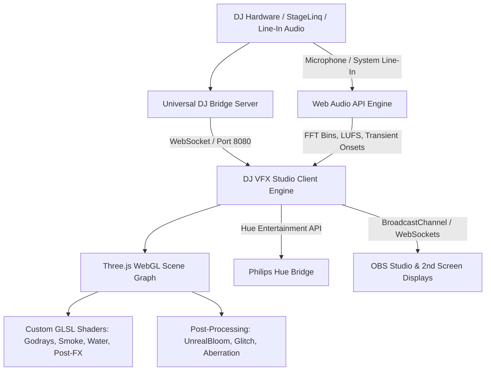

# 🎧 DJ VFX Studio

[](https://threejs.org/)
[](https://vitejs.dev/)
[](https://github.com/vikingvoodoo1/dj-vfx-studio)
[](LICENSE)

**DJ VFX Studio** is a real-time, audio-reactive 3D visual effects and stage lighting platform tailored for live DJs, streaming broadcasts (OBS), club venues, and festival stages. Built entirely on **WebGL (Three.js)** and **custom GLSL shaders**, it combines authentic concert moving-head rigs, volumetric participating media fog, retro cyber synthwave landscapes, and live DJ deck telemetry with seamless Denon DJ StageLinq bridge integration and Philips Hue lighting control.

---

## 🌟 Key Highlights

- **19 GPU-Accelerated 3D VFX Scenes**: Spanning volumetric laser arrays, authentic moving-head godray fixtures, disco mirror balls, synthwave landscapes, cosmic galaxies, and live deck waveform visualizers.
- **High-Precision Audio Engine**: Sub-millisecond transient onset detection, 3-band FFT spectrum analysis (Bass, Mid, Treble), true ITU-R BS.1770 LUFS loudness metering, and dBFS peak-hold telemetry.
- **StageLinq & DJ Hardware Bridge**: Zero-latency WebSocket bridge connecting live track metadata, cue points, BPM, and active fader status from Denon DJ / Engine OS hardware.
- **Philips Hue Entertainment Streaming**: Real-time lighting synchronization mapping live bass impacts, drops, and scene color themes directly to smart club/room lights.
- **Multi-Screen & OBS Broadcast**: Native multi-window sync via `BroadcastChannel` and WebSocket relay with transparent HUD layers, clean display modes, and direct OBS browser source support.
- **Custom DJ Branding Engine**: 3D extruded and billboard DJ logo overlays with beat-reactive pulse physics, protective shields, and 3D orbit/center spin modes.

---

## 🗂️ VFX Scene Bank (19 Distinct Modes)

### 📊 Category 1: Equalizers & Decks (FX 0–3)
- **FX 0: 3D Studio LED Equalizer Wall** — Segmented stadium LED towers with peak-hold physics and dynamic hue cascades.
- **FX 1: Circular Spectrum Mandala** — Radial 360° FFT frequency kaleidoscope with chromatic resonance.
- **FX 2: Fluid Glowing Wave Matrix** — Undulating neon sine ribbon grid reacting dynamically to mid-range and treble harmonics.
- **FX 3: DJ Deck Scrolling Waveforms** — Authentic Pioneer/Denon-style 3-band RGB scrolling audio waveform history with cue markers, active loop brackets, and deck HUD telemetry.

### ⚡ Category 2: Lasers & Disco (FX 4–9)
- **FX 4: Authentic Nightclub Mirror Ball Rig** — Motorized faceted mirror sphere with dual overhead pinspots, dancing room specular sweeps, and dancefloor reflection pools.
- **FX 5: 70s Disco Dancefloor** — Classic illuminated *Saturday Night Fever* geometric floor grid pulsing to the four-on-the-floor beat.
- **FX 6: Dual-Bank Volumetric Searchlights** — Concert arena skyward searchlight towers with volumetric cone geometry and cross-sweeping patterns.
- **FX 7: Saber Multi-Beam DJ Fixtures** — Multi-head batten laser bars creating tight parallel and fan beam geometries.
- **FX 8: Strobe Hyper-Rings & Laser Matrix** — Concentric strobe rings pulsing with transient impacts and high-energy laser grids.
- **FX 9: Silhouette Club Dancers in Glowing Box Light Walls** — Atmospheric backlit dancing silhouette club performers framed in reactive color boxes.

### 🕸️ Category 3: Cyber & Retro (FX 10–13)
- **FX 10: Synthwave Cyber Grid** — Infinite perspective neon wireframe grid rushing into the horizon with bass-reactive mountain ranges.
- **FX 11: Synthwave River, Mountains & 80s Sun** — Custom procedural GLSL shader featuring segmented outrun sun rays, glowing reflective river, and twilight star skies.
- **FX 12: Matrix Code Rain** — Classic cascading digital rain glyphs rendered in glowing phosphor green with audio speed modulation.
- **FX 13: Retro Arcade 80s Theme** — Vintage vector CRT arcade aesthetics with wireframe geometry and nostalgic neon glow.

### 🌌 Category 4: Space, Particles & Stage Lights (FX 14–18)
- **FX 14: Warp Speed Starfield** — Hyperdrive relativistic star streaks accelerating dynamically on track drops.
- **FX 15: Spiral Galaxy Cosmic Vortex** — 3D volumetric logarithmic accretion spiral with millions of stellar bodies and core luminance.
- **FX 16: Hyper Particle Stream** — GPU curl-noise particle strands flowing along smooth Bézier splines with chromatic velocity grading.
- **FX 17: Time.is Precision DJ Clock & Spectrum** — Millisecond-accurate synchronized stage clock with active Denon DJ BPM readout and surrounding gyro gimbal rings.
- **FX 18: Sweeping Godray Disco Lights** — Top truss moving-head rig featuring 8 independent spotlights with Wawa Sensei volumetric godray cones, Mie forward scattering, continuous 3D FBM participating media smoke, staggered heavy bass chase flaring, and mathematically locked elliptical floor reflection pools.

---

## 🚀 Getting Started

### Prerequisites
- Node.js (v18.0.0 or later)
- Modern WebGL2-compatible browser (Chrome, Edge, Brave, Safari, Firefox)

### Installation
```bash
# Clone the repository
git clone https://github.com/vikingvoodoo1/dj-vfx-studio.git
cd dj-vfx-studio

# Install dependencies
npm install
```

### Development Server
```bash
# Start Vite development server
npm run dev
```
Open `http://localhost:5173` in your browser.

### Building for Production
```bash
# Build optimized client bundle
npm run build

# Preview production build locally
npm run preview
```

### Running the DJ Hardware & StageLinq Bridge
```bash
# Launch the StageLinq & Philips Hue bridge daemon
node server/stagelinq-bridge.js
```
The bridge listens on port `8080` (WebSocket) and establishes UDP discovery with Denon DJ hardware on your local network.

---

## 🎛️ Architecture & Technology Stack



- **Frontend Core**: Vanilla JavaScript (ES Modules), HTML5 Canvas, Three.js (r128+).
- **Shader Pipeline**: Custom GLSL fragment and vertex shaders for raymarching, forward scattering, volumetric lighting, and FBM participating media.
- **Audio Processing**: High-resolution Web Audio API `AnalyserNode`, time-domain RMS/LUFS calculator, exponential smoothing filters.
- **Backend & Network**: Node.js, `ws` (WebSockets), `dgram` (UDP discovery for StageLinq protocol), `node-hue-api`.

---

## ⌨️ Keyboard Shortcuts & Quick Controls

| Key | Action |
|---|---|
| `Space` | Manual Strobe Flash / Beat Trigger Pulse |
| `0` – `9` | Instant Scene Switch (FX 0 through FX 9) |
| `Shift + 0` – `Shift + 8` | Instant Scene Switch (FX 10 through FX 18) |
| `L` | Toggle DJ Logo Layer Visibility |
| `M` | Cycle Logo Spin Mode (Center Spin / 3D Orbit / Billboard) |
| `S` | Toggle Logo Protective Shield |
| `B` | Open Bloom & Post-Processing Calibrator |
| `C` | Toggle Clean Display Mode (Hide all HUD overlays for clean projectors) |
| `F` | Toggle Fullscreen Mode |

---

## 📄 License

This project is licensed under the MIT License — see the [LICENSE](LICENSE) file for details.
